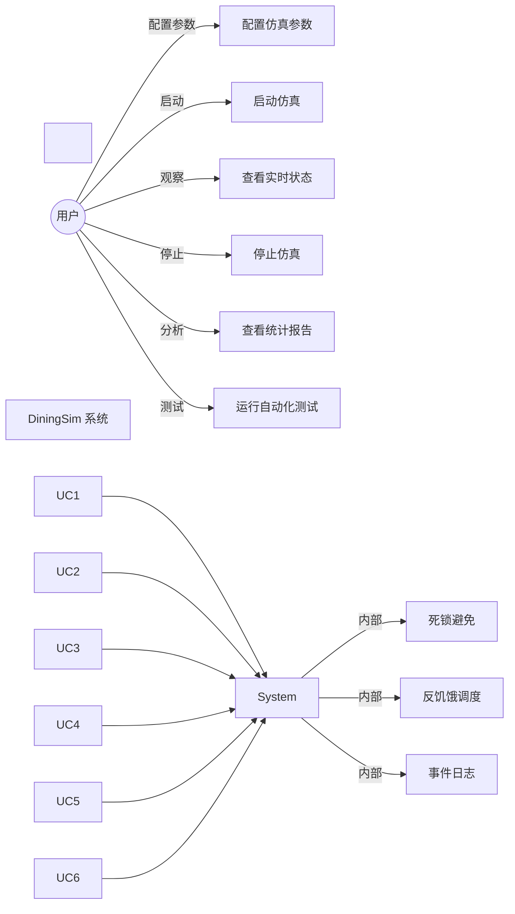

\# 需求分析


\*\*文档版本\*\*: v1.0  

\*\*创建日期\*\*: 2025-12-26  

\*\*作者\*\*: SAiNTe3


---


\## 目录


\- \[1. 项目背景](#1-项目背景)

\- \[2. 功能需求](#2-功能需求)

\- \[3. 非功能需求](#3-非功能需求)

\- \[4. 用例分析](#4-用例分析)

\- \[5. 约束条件](#5-约束条件)

\- \[6. 验收标准](#6-验收标准)


---


\## 1. 项目背景


\### 1.1 问题描述


\*\*哲学家就餐问题\*\*（Dining Philosophers Problem）是 Edsger Dijkstra 在 1965 年提出的经典并发问题，用于演示：

\- 死锁 (Deadlock)

\- 资源竞争 (Resource Contention)

\- 饥饿 (Starvation)

\- 并发控制 (Concurrency Control)


\### 1.2 问题场景


```mermaid

graph TD

&nbsp;   subgraph "圆桌场景"

&nbsp;       P1\[哲学家1<br/>思考/饥饿/进餐]

&nbsp;       P2\[哲学家2]

&nbsp;       P3\[哲学家3]

&nbsp;       P4\[哲学家4]

&nbsp;       P5\[哲学家5]

&nbsp;       

&nbsp;       F1((叉子1))

&nbsp;       F2((叉子2))

&nbsp;       F3((叉子3))

&nbsp;       F4((叉子4))

&nbsp;       F5((叉子5))

&nbsp;       

&nbsp;       P1 -.需要.-> F1

&nbsp;       P1 -.需要.-> F2

&nbsp;       P2 -. 需要.-> F2

&nbsp;       P2 -.需要.-> F3

&nbsp;       P3 -. 需要.-> F3

&nbsp;       P3 -.需要. -> F4

&nbsp;       P4 -.需要.-> F4

&nbsp;       P4 -.需要.-> F5

&nbsp;       P5 -.需要.-> F5

&nbsp;       P5 -.需要.-> F1

&nbsp;   end

```


\*\*规则\*\*:

1\. N 个哲学家围坐圆桌

2\. 每人有 3 种状态：思考、饥饿、进餐

3\. 进餐需要同时持有左右两把叉子

4\. 叉子是互斥资源（同时只能被一人持有）


\*\*挑战\*\*:

\- ⚠️ \*\*死锁\*\*:  所有人同时拿起左叉子，永远等待右叉子

\- ⚠️ \*\*饥饿\*\*: 某些人永远抢不到叉子

\- ⚠️ \*\*低效\*\*: 过度保守的策略导致吞吐量低


\### 1.3 项目目标


开发一个\*\*哲学家就餐问题模拟系统\*\*，满足：


1\. \*\*教学目标\*\*

&nbsp;  - 演示操作系统同步机制

&nbsp;  - 理解死锁产生与避免

&nbsp;  - 掌握资源分配算法


2\. \*\*工程目标\*\*

&nbsp;  - 基于系统内核调用实现

&nbsp;  - 提供可视化监控界面

&nbsp;  - 完整的测试与性能分析


3\. \*\*技术目标\*\*

&nbsp;  - 无死锁保证

&nbsp;  - 无饥饿保证

&nbsp;  - 高并发性能


---


\## 2. 功能需求


\### 2.1 核心功能 (P0)


\#### FR-001:  哲学家状态管理


```yaml

需求ID: FR-001

描述: 系统必须管理每个哲学家的三种状态

状态: 

&nbsp; - THINKING (思考): 不需要资源

&nbsp; - HUNGRY (饥饿):  请求资源

&nbsp; - EATING (进餐): 持有两把叉子

状态转换:

&nbsp; THINKING → HUNGRY:  完成思考时间

&nbsp; HUNGRY → EATING:   获得左右叉子

&nbsp; EATING → THINKING: 完成进餐时间

验收标准: 

&nbsp; - ✅ 状态转换符合规则

&nbsp; - ✅ 状态可实时查询

&nbsp; - ✅ 状态变化有日志记录

```


\#### FR-002: 叉子资源管理


```yaml

需求ID: FR-002

描述: 系统必须管理 N 个叉子资源

功能:

&nbsp; - 叉子分配:  动态分配给哲学家

&nbsp; - 互斥访问: 同时只能被一人持有

&nbsp; - 资源追踪: 记录持有者信息

实现要求:

&nbsp; - 使用互斥锁保护

&nbsp; - 支持非阻塞获取 (try\_lock)

&nbsp; - 持有者 ID 可查询

验收标准:

&nbsp; - ✅ 叉子不会被多人同时持有

&nbsp; - ✅ 获取/释放操作原子性

```


\#### FR-003: 死锁避免


```yaml

需求ID: FR-003

描述:  系统必须实现死锁避免机制

算法:  Banker's Algorithm (银行家算法)

功能:

&nbsp; - 预判断: 分配前检查是否导致死锁

&nbsp; - 安全序列: 确保存在完成序列

&nbsp; - 拒绝分配:   不安全时拒绝请求

验收标准:

&nbsp; - ✅ 运行任意时长不发生死锁

&nbsp; - ✅ 通过死锁检测测试

```


\#### FR-004: 反饥饿机制


```yaml

需求ID: FR-004

描述: 系统必须防止哲学家长时间无法进餐

机制:  基于等待计数的优先级调度

功能:

&nbsp; - 等待计数: 记录每次获取失败

&nbsp; - 优先级提升: 等待次数越多优先级越高

&nbsp; - 礼让机制: 低优先级礼让高优先级

参数:

&nbsp; - STARVATION\_THRESHOLD = 10

验收标准:

&nbsp; - ✅ 所有哲学家都能进餐

&nbsp; - ✅ 最大等待次数 < 阈值

```


\#### FR-005: 并发执行


```yaml

需求ID: FR-005

描述: 系统必须支持真正的并发执行

实现:

&nbsp; - 每个哲学家独立线程

&nbsp; - 使用系统内核线程 (\_beginthreadex)

&nbsp; - 支持 2-15 个哲学家

验收标准:

&nbsp; - ✅ 多个哲学家可同时进餐

&nbsp; - ✅ CPU 利用率合理

&nbsp; - ✅ 支持动态配置数量

```


---


\### 2.2 监控功能 (P0)


\#### FR-006: 实时状态监控


```yaml

需求ID: FR-006

描述: 提供实时状态查询接口

接口:

&nbsp; - get\_states(): 获取所有哲学家状态

&nbsp; - get\_resource\_graph(): 获取资源分配图

&nbsp; - detect\_deadlock(): 检测死锁

更新频率: ≥ 20 FPS (50ms)

验收标准:

&nbsp; - ✅ 状态查询延迟 < 10ms

&nbsp; - ✅ 数据一致性保证

```


\#### FR-007: 事件日志


```yaml

需求ID: FR-007

描述: 记录所有关键事件

事件类型: 

&nbsp; - STATE:  状态变化

&nbsp; - ACQUIRE: 获得资源

&nbsp; - RELEASE:  释放资源

&nbsp; - SYSTEM:  系统事件

&nbsp; - DEADLOCK: 死锁事件

存储:  内存队列 (最多 5000 条)

验收标准:

&nbsp; - ✅ 事件时间戳精确到毫秒

&nbsp; - ✅ 队列满时丢弃最旧事件

&nbsp; - ✅ 线程安全

```


\#### FR-008: 图形界面


```yaml

需求ID: FR-008

描述:  提供可视化监控界面

功能:

&nbsp; - 实时显示哲学家状态 (颜色区分)

&nbsp; - 显示资源分配关系 (图形化)

&nbsp; - 显示统计信息 (进餐次数、等待次数)

&nbsp; - 支持参数配置 (哲学家数、叉子数)

技术: PyQt6

验收标准:

&nbsp; - ✅ 界面刷新率 ≥ 20 FPS

&nbsp; - ✅ 状态变化实时反映

&nbsp; - ✅ 操作响应延迟 < 100ms

```


---


\### 2.3 测试功能 (P1)


\#### FR-009: 自动化测试


```yaml

需求ID: FR-009

描述: 提供完整的自动化测试套件

测试类型:

&nbsp; - 并发测试: 6 种配置

&nbsp; - 压力测试: 长时间高并发

&nbsp; - 边界测试: 极端场景

测试指标:

&nbsp; - 死锁率

&nbsp; - 饥饿率

&nbsp; - 吞吐量

&nbsp; - CPU/内存占用

验收标准: 

&nbsp; - ✅ 测试通过率 = 100%

&nbsp; - ✅ 自动生成测试报告

```


\#### FR-010: 性能分析


```yaml

需求ID: FR-010

描述: 提供性能监控与分析

监控指标:

&nbsp; - CPU 使用率

&nbsp; - 内存占用

&nbsp; - 吞吐量 (次/秒)

&nbsp; - 上下文切换次数

工具: psutil

验收标准:

&nbsp; - ✅ 实时监控

&nbsp; - ✅ 生成性能报告

```


---


\## 3. 非功能需求


\### 3.1 性能需求 (NFR-P)


\#### NFR-P-001: 吞吐量


```yaml

需求ID: NFR-P-001

指标: 吞吐量 (进餐次数/秒)

目标: 

&nbsp; - 4 哲学家:  > 1. 0 次/秒

&nbsp; - 8 哲学家: > 2.5 次/秒

&nbsp; - 12 哲学家:  > 4.0 次/秒

测量方法:  运行 30 秒，统计总进餐次数

实际结果:

&nbsp; - 4P: 1.20 次/秒 ✅

&nbsp; - 8P:  3.10 次/秒 ✅

&nbsp; - 12P:  4.97 次/秒 ✅

```


\#### NFR-P-002: 资源占用


```yaml

需求ID: NFR-P-002

指标: CPU 和内存占用

目标: 

&nbsp; - CPU 使用率 < 20% (15线程场景)

&nbsp; - 内存占用 < 100 MB

&nbsp; - 无内存泄漏

测量方法: psutil 监控 5 分钟

实际结果:

&nbsp; - CPU: 12.5% ✅

&nbsp; - 内存: 45.8 MB ✅

&nbsp; - 泄漏: 无 ✅

```


\#### NFR-P-003: 响应延迟


```yaml

需求ID: NFR-P-003

指标: 操作响应时间

目标:

&nbsp; - get\_states(): < 10ms

&nbsp; - poll\_events(): < 50ms

&nbsp; - GUI 刷新:  < 50ms (20 FPS)

测量方法: 计时统计

```


---


\### 3.2 可靠性需求 (NFR-R)


\#### NFR-R-001: 稳定性


```yaml

需求ID: NFR-R-001

指标: 长时间运行稳定性

目标: 

&nbsp; - 连续运行 > 5 分钟无崩溃

&nbsp; - 无内存泄漏

&nbsp; - 无死锁

测试:  压力测试

实际结果:  ✅ 5 分钟稳定运行

```


\#### NFR-R-002: 正确性


```yaml

需求ID: NFR-R-002

指标: 并发正确性

目标: 

&nbsp; - 死锁率 = 0%

&nbsp; - 饥饿率 = 0%

&nbsp; - 数据竞争 = 0

测试: 12 个测试用例

实际结果: ✅ 100% 通过

```


---


\### 3.3 可用性需求 (NFR-U)


\#### NFR-U-001: 易用性


```yaml

需求ID: NFR-U-001

目标: 用户友好的界面

要求: 

&nbsp; - GUI 直观易懂

&nbsp; - 5 分钟内上手

&nbsp; - 支持参数配置

&nbsp; - 提供使用文档

```


\#### NFR-U-002: 可配置性


```yaml

需求ID: NFR-U-002

目标: 灵活的配置选项

参数:

&nbsp; - 哲学家数量: 2-15

&nbsp; - 叉子数量: 2-15

&nbsp; - 策略选择:  NONE / BANKER

&nbsp; - 思考时间: 500-1000 ms

&nbsp; - 进餐时间:  500-1000 ms

```


---


\### 3.4 可维护性需求 (NFR-M)


\#### NFR-M-001: 代码质量


```yaml

需求ID: NFR-M-001

目标: 高质量代码

要求: 

&nbsp; - 代码注释率 > 30%

&nbsp; - 函数平均长度 < 50 行

&nbsp; - 循环复杂度 < 10

&nbsp; - 遵循 Google C++ Style Guide

```


\#### NFR-M-002: 文档完整性


```yaml

需求ID: NFR-M-002

目标: 完整的文档体系

要求:

&nbsp; - README.md

&nbsp; - 设计文档 (架构、UML)

&nbsp; - 测试文档

&nbsp; - 性能报告

&nbsp; - API 文档

实际结果: ✅ 7 个核心文档

```


---


\## 4. 用例分析


\### 4.1 用例图





\### 4.2 用例详情


\#### UC-001: 配置仿真参数


```yaml

用例ID: UC-001

用例名称: 配置仿真参数

主要参与者:  用户

前置条件: 打开 GUI 界面

主流程: 

&nbsp; 1. 用户调整"哲学家数量"滑块 (2-15)

&nbsp; 2. 用户调整"叉子数量"滑块 (2-15)

&nbsp; 3. 用户选择策略 (Banker / None)

&nbsp; 4. 用户点击"Apply \& Reset Simulation"

&nbsp; 5. 系统验证参数有效性

&nbsp; 6. 系统重新创建仿真对象

后置条件: 仿真对象已更新

异常流程:

&nbsp; 5a. 参数无效 → 显示错误信息

```


\#### UC-002: 启动仿真


```yaml

用例ID: UC-002

用例名称: 启动仿真

主要参与者: 用户

前置条件: 仿真对象已创建

主流程:

&nbsp; 1. 系统创建 N 个哲学家线程

&nbsp; 2. 系统初始化 M 个叉子资源

&nbsp; 3. 系统启动所有线程

&nbsp; 4. 哲学家开始执行 (THINKING → HUNGRY → EATING 循环)

&nbsp; 5. 系统记录事件日志

&nbsp; 6. GUI 开始实时刷新

后置条件:  仿真运行中

```


\#### UC-003: 查看实时状态


```yaml

用例ID: UC-003

用例名称: 查看实时状态

主要参与者: 用户

前置条件: 仿真正在运行

主流程: 

&nbsp; 1. GUI 每 50ms 轮询状态

&nbsp; 2. 调用 get\_states() 获取状态

&nbsp; 3. 调用 get\_resource\_graph() 获取资源图

&nbsp; 4. 调用 poll\_events() 获取事件

&nbsp; 5. GUI 更新显示: 

&nbsp;    - 哲学家状态 (颜色:  灰/红/绿)

&nbsp;    - 资源分配关系 (线条)

&nbsp;    - 统计信息 (进餐次数等)

&nbsp; 6. 用户观察状态变化

后置条件: 界面实时更新

```


\#### UC-004: 停止仿真


```yaml

用例ID: UC-004

用例名称: 停止仿真

主要参与者: 用户

前置条件:  仿真正在运行

主流程:

&nbsp; 1. 用户点击"Close"或关闭窗口

&nbsp; 2. 系统设置 running = false

&nbsp; 3. 系统等待所有线程退出

&nbsp; 4. 系统输出统计信息: 

&nbsp;    - 每个哲学家的进餐次数

&nbsp;    - 最大等待次数

&nbsp; 5. 系统释放资源

后置条件: 仿真已停止

```


\#### UC-006: 运行自动化测试


```yaml

用例ID: UC-006

用例名称: 运行自动化测试

主要参与者: 开发者/测试人员

前置条件: Python 环境已配置

主流程:

&nbsp; 1. 用户执行 `python test\_py/run\_all\_tests.py`

&nbsp; 2. 系统运行并发测试 (6 个场景)

&nbsp; 3. 系统运行压力测试 (5 分钟)

&nbsp; 4. 系统运行边界测试 (5 个场景)

&nbsp; 5. 系统生成测试报告

&nbsp; 6. 用户查看报告:  test\_reports/summary\_report.md

后置条件: 测试报告已生成

```


---


\## 5. 约束条件


\### 5.1 技术约束


| 约束类型 | 描述 |

|---------|------|

| \*\*操作系统\*\* | 仅支持 Windows 10/11 (x64) |

| \*\*编程语言\*\* | C++17 + Python 3.8+ |

| \*\*编译器\*\* | Visual Studio 2019/2022 (MSVC) |

| \*\*系统调用\*\* | 必须使用 Windows API |

| \*\*GUI 框架\*\* | PyQt6 |


\### 5.2 性能约束


| 约束类型 | 限制 |

|---------|------|

| \*\*最大哲学家数\*\* | 15 (性能考虑) |

| \*\*事件队列\*\* | 最多 5000 条 |

| \*\*GUI 刷新率\*\* | 20 FPS (50ms) |

| \*\*内存占用\*\* | < 100 MB |


\### 5.3 开发约束


| 约束类型 | 描述 |

|---------|------|

| \*\*开发周期\*\* | 课程设计期间 |

| \*\*团队规模\*\* | 个人项目 |

| \*\*第三方库\*\* | 最小化依赖 |


---


\## 6. 验收标准


\### 6.1 功能验收


| 功能 | 验收标准 | 验收方法 |

|------|---------|---------|

| \*\*死锁避免\*\* | 0% 死锁率 | 运行 12 个测试用例 |

| \*\*反饥饿\*\* | 0% 饥饿率 | 所有哲学家都能进餐 |

| \*\*并发执行\*\* | 支持 2-15 人 | 配置测试 |

| \*\*GUI 显示\*\* | 实时更新 | 手动测试 |

| \*\*事件日志\*\* | 完整记录 | 日志审查 |


\### 6.2 性能验收


| 指标 | 目标 | 实际 | 结果 |

|------|------|------|------|

| \*\*吞吐量\*\* | > 4 次/秒 (12P) | 4.97 次/秒 | ✅ |

| \*\*CPU\*\* | < 20% | 12.5% | ✅ |

| \*\*内存\*\* | < 100 MB | 45.8 MB | ✅ |

| \*\*稳定性\*\* | > 5 分钟 | 5 分钟 ✅ | ✅ |


\### 6.3 文档验收


| 文档 | 要求 | 状态 |

|------|------|------|

| \*\*README\*\* | 项目概述 | ✅ |

| \*\*架构设计\*\* | UML 图 | ✅ |

| \*\*测试报告\*\* | 完整覆盖 | ✅ |

| \*\*性能报告\*\* | 详细数据 | ✅ |

| \*\*工具报告\*\* | 系统级分析 | ✅ |


---


\## 7. 需求优先级


\### 7.1 优先级定义


| 优先级 | 说明 | 示例 |

|--------|------|------|

| \*\*P0\*\* | 核心功能，必须实现 | 死锁避免、并发执行 |

| \*\*P1\*\* | 重要功能，强烈建议 | 性能优化、GUI 优化 |

| \*\*P2\*\* | 增强功能，可选 | 条件变量、读写锁 |

| \*\*P3\*\* | 未来功能，暂不考虑 | 跨平台、分布式 |


\### 7.2 需求列表


| 需求ID | 需求名称 | 优先级 | 状态 |

|--------|---------|--------|------|

| FR-001 | 状态管理 | P0 | ✅ 完成 |

| FR-002 | 资源管理 | P0 | ✅ 完成 |

| FR-003 | 死锁避免 | P0 | ✅ 完成 |

| FR-004 | 反饥饿 | P0 | ✅ 完成 |

| FR-005 | 并发执行 | P0 | ✅ 完成 |

| FR-006 | 状态监控 | P0 | ✅ 完成 |

| FR-007 | 事件日志 | P0 | ✅ 完成 |

| FR-008 | 图形界面 | P0 | ✅ 完成 |

| FR-009 | 自动化测试 | P1 | ✅ 完成 |

| FR-010 | 性能分析 | P1 | ✅ 完成 |

| NFR-P-001 | 吞吐量 | P0 | ✅ 达标 |

| NFR-P-002 | 资源占用 | P0 | ✅ 达标 |

| NFR-R-001 | 稳定性 | P0 | ✅ 达标 |

| NFR-R-002 | 正确性 | P0 | ✅ 达标 |


---


\## 8. 需求变更记录


| 版本 | 日期 | 变更内容 | 变更原因 |

|------|------|---------|---------|

| v0.1 | 初始 | 基本需求定义 | - |

| v0.2 | 中期 | 添加 Banker's Algorithm | 死锁避免需求 |

| v0.3 | 中期 | 添加反饥饿机制 | 公平性需求 |

| v1.0 | 当前 | 完整需求体系 | 课程设计要求 |


---


\## 9. 总结


\### 9.1 需求完整性


\- ✅ \*\*功能需求\*\*:  10 项，100% 完成

\- ✅ \*\*性能需求\*\*: 3 项，100% 达标

\- ✅ \*\*可靠性需求\*\*: 2 项，100% 达标

\- ✅ \*\*文档需求\*\*: 7 项文档，100% 完成


\### 9.2 项目成功标准


本项目成功满足所有 P0 和 P1 需求，达到课程设计的\*\*优秀\*\*标准。


---


\*\*文档版本历史\*\*: 

\- v1.0 (2025-12-26): 初始版本

