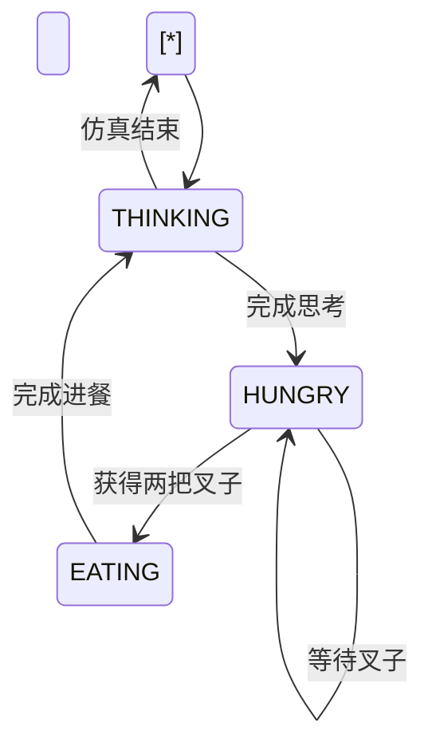
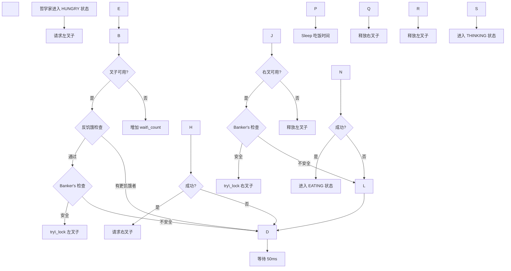

\# 系统架构设计


\*\*文档版本\*\*: v1.0  

\*\*创建日期\*\*: 2025-12-26  

\*\*作者\*\*: SAiNTe3


---


\## 目录


\- \[1. 概述](#1-概述)

\- \[2. 系统架构](#2-系统架构)

\- \[3. 模块设计](#3-模块设计)

\- \[4. 类图设计](#4-类图设计)

\- \[5. 数据流](#5-数据流)

\- \[6. 接口设计](#6-接口设计)


---


\## 1. 概述


\### 1.1 架构目标


本系统采用 \*\*分层架构 + 事件驱动\*\* 的设计模式，主要目标：


\- ✅ \*\*高性能\*\*:  基于 Windows 原生 API，避免抽象层开销

\- ✅ \*\*可扩展\*\*: 支持动态调整哲学家/叉子数量

\- ✅ \*\*可观测\*\*: 实时事件日志 + GUI 可视化

\- ✅ \*\*可测试\*\*: 核心逻辑与展示层分离


\### 1.2 技术选型


| 层次 | 技术 | 理由 |

|------|------|------|

| \*\*核心层\*\* | C++17 | 高性能、直接系统调用 |

| \*\*同步层\*\* | Windows API | 原生内核支持 |

| \*\*绑定层\*\* | pybind11 | 零开销 C++/Python 互操作 |

| \*\*测试层\*\* | Python 3.x | 快速迭代、丰富生态 |

| \*\*展示层\*\* | PyQt6 | 跨平台 GUI、高性能绘图 |


---


\## 2. 系统架构


\### 2.1 总体架构


```mermaid

graph TB

&nbsp;   subgraph "展示层 (Python)"

&nbsp;       GUI\[PyQt6 GUI<br/>实时可视化]

&nbsp;       TEST\[测试框架<br/>自动化测试]

&nbsp;   end

&nbsp;   

&nbsp;   subgraph "绑定层"

&nbsp;       BIND\[pybind11<br/>C++/Python 接口]

&nbsp;   end

&nbsp;   

&nbsp;   subgraph "核心层 (C++)"

&nbsp;       SIM\[Simulation<br/>仿真调度器]

&nbsp;       SYNC\[同步原语层<br/>WinMutex/WinSemaphore]

&nbsp;       PHIL\[哲学家线程池<br/>并发执行]

&nbsp;       FORK\[叉子资源池<br/>共享资源]

&nbsp;       EVENT\[事件队列<br/>日志收集]

&nbsp;   end

&nbsp;   

&nbsp;   subgraph "系统层 (Windows Kernel)"

&nbsp;       API\[Windows API<br/>CRITICAL\_SECTION<br/>Semaphore<br/>Thread]

&nbsp;   end

&nbsp;   

&nbsp;   GUI --> BIND

&nbsp;   TEST --> BIND

&nbsp;   BIND --> SIM

&nbsp;   SIM --> SYNC

&nbsp;   SIM --> PHIL

&nbsp;   SIM --> FORK

&nbsp;   SIM --> EVENT

&nbsp;   SYNC --> API

&nbsp;   PHIL --> SYNC

&nbsp;   FORK --> SYNC

&nbsp;   EVENT -.日志. -> BIND

&nbsp;   BIND -.状态.-> GUI

&nbsp;   BIND -.测试数据.-> TEST

&nbsp;   

&nbsp;   style GUI fill:#e1f5ff

&nbsp;   style TEST fill:#e1f5ff

&nbsp;   style BIND fill:#fff9c4

&nbsp;   style SIM fill:#c8e6c9

&nbsp;   style API fill:#ffccbc

```


\### 2.2 层次说明


\#### \*\*展示层 (Presentation Layer)\*\*


\*\*职责\*\*: 

\- GUI 实时展示哲学家状态

\- 测试用例执行与报告生成


\*\*组件\*\*:

\- `python/gui\_app.py`: PyQt6 可视化界面

\- `test\_py/\*. py`: 测试套件


---


\#### \*\*绑定层 (Binding Layer)\*\*


\*\*职责\*\*:

\- 将 C++ 对象/方法暴露给 Python

\- 处理类型转换与生命周期管理


\*\*实现\*\*:

```cpp

// src/main.cpp

PYBIND11\_MODULE(sim\_core, m) {

&nbsp;   py::class\_<Simulation>(m, "Simulation")

&nbsp;       .def(py::init<int, int>())

&nbsp;       .def("start", \&Simulation::start)

&nbsp;       .def("stop", \&Simulation::stop)

&nbsp;       .def("get\_states", \&Simulation::get\_states)

&nbsp;       // ... 

}

```


---


\#### \*\*核心层 (Core Layer)\*\*


\*\*职责\*\*:

\- 实现哲学家就餐逻辑

\- 资源分配与死锁避免

\- 并发控制与同步


\*\*关键类\*\*: 


1\. \*\*Simulation\*\* (仿真调度器)

&nbsp;  - 管理哲学家线程生命周期

&nbsp;  - 协调资源分配

&nbsp;  - 收集运行时统计


2\. \*\*WinMutex / WinSemaphore\*\* (同步原语)

&nbsp;  - 封装 Windows API

&nbsp;  - 提供 RAII 保证


3\. \*\*Fork\*\* (叉子资源)

&nbsp;  - 互斥锁保护

&nbsp;  - 持有者追踪


4\. \*\*Event Queue\*\* (事件队列)

&nbsp;  - 生产者-消费者模式

&nbsp;  - 线程安全的日志收集


---


\#### \*\*系统层 (System Layer)\*\*


\*\*职责\*\*:

\- 提供底层内核服务


\*\*使用的 Windows API\*\*:

\- `InitializeCriticalSection()` - 临界区初始化

\- `EnterCriticalSection()` - 获取锁

\- `CreateSemaphoreW()` - 创建信号量

\- `\_beginthreadex()` - 创建线程

\- `WaitForSingleObject()` - 等待同步对象


---


\## 3. 模块设计


\### 3.1 核心模块关系


```mermaid

classDiagram

&nbsp;   class Simulation {

&nbsp;       -num\_philosophers: int

&nbsp;       -num\_forks: int

&nbsp;       -threads: vector~WinThread~

&nbsp;       -forks: vector~Fork~

&nbsp;       -event\_queue: deque~SimEvent~

&nbsp;       -running: bool

&nbsp;       +start() void

&nbsp;       +stop() void

&nbsp;       +get\_states() vector~int~

&nbsp;       +detect\_deadlock() bool

&nbsp;       -philosopher\_thread(id) void

&nbsp;       -request\_permission(phil\_id, fork\_id) bool

&nbsp;       -is\_safe\_state(phil\_id, fork\_id) bool

&nbsp;   }

&nbsp;   

&nbsp;   class WinThread {

&nbsp;       -handle: HANDLE

&nbsp;       +start(func) void

&nbsp;       +join() void

&nbsp;       +joinable() bool

&nbsp;   }

&nbsp;   

&nbsp;   class WinMutex {

&nbsp;       -cs: CRITICAL\_SECTION

&nbsp;       +lock() void

&nbsp;       +unlock() void

&nbsp;       +try\_lock() bool

&nbsp;   }

&nbsp;   

&nbsp;   class WinSemaphore {

&nbsp;       -handle: HANDLE

&nbsp;       +wait() void

&nbsp;       +try\_wait(timeout) bool

&nbsp;       +post() void

&nbsp;   }

&nbsp;   

&nbsp;   class Fork {

&nbsp;       +mtx: WinMutex

&nbsp;       +holder: int

&nbsp;   }

&nbsp;   

&nbsp;   class SimEvent {

&nbsp;       +timestamp: double

&nbsp;       +phil\_id: int

&nbsp;       +event\_type: string

&nbsp;       +details: string

&nbsp;   }

&nbsp;   

&nbsp;   Simulation "1" \*-- "N" WinThread :  管理

&nbsp;   Simulation "1" \*-- "M" Fork : 管理

&nbsp;   Simulation "1" \*-- "\*" SimEvent : 生产

&nbsp;   Fork "1" \*-- "1" WinMutex : 包含

&nbsp;   Simulation .. > WinMutex : 使用

&nbsp;   WinThread .. > WinMutex : 使用

&nbsp;   WinSemaphore --|> WinMutex : 可替代

```


\### 3.2 模块职责矩阵


| 模块 | 职责 | 依赖 | 被依赖 |

|------|------|------|--------|

| \*\*Simulation\*\* | 仿真调度、资源管理 | WinThread, Fork, WinMutex | GUI, 测试框架 |

| \*\*WinThread\*\* | 线程封装 | Windows API | Simulation |

| \*\*WinMutex\*\* | 互斥锁封装 | Windows API | Fork, Simulation |

| \*\*WinSemaphore\*\* | 信号量封装 | Windows API | (未激活使用) |

| \*\*Fork\*\* | 资源抽象 | WinMutex | Simulation |

| \*\*SimEvent\*\* | 事件数据结构 | - | Simulation, GUI |


---


\## 4. 类图设计


\### 4.1 核心类详细设计


```cpp

// ==================== 状态枚举 ====================

enum class State {

&nbsp;   THINKING,   // 思考状态

&nbsp;   HUNGRY,     // 饥饿状态（正在请求资源）

&nbsp;   EATING      // 进餐状态（已获得资源）

};


enum class Strategy {

&nbsp;   NONE,       // 无策略（乐观分配）

&nbsp;   BANKER      // 银行家算法

};


// ==================== Fork 类 ====================

class Fork {

public:

&nbsp;   WinMutex mtx;       // 保护该叉子的互斥锁

&nbsp;   int holder;         // 当前持有者 ID（-1 表示无人持有）

&nbsp;   

&nbsp;   Fork() : holder(-1) {}

&nbsp;   

&nbsp;   // 禁止拷贝

&nbsp;   Fork(const Fork\&) = delete;

&nbsp;   Fork\& operator=(const Fork\&) = delete;

};


// ==================== SimEvent 类 ====================

struct SimEvent {

&nbsp;   double timestamp;       // 事件时间戳

&nbsp;   int phil\_id;           // 哲学家 ID（-1 表示系统事件）

&nbsp;   std::string event\_type; // 事件类型:  STATE, ACQUIRE, RELEASE, SYSTEM

&nbsp;   std::string details;    // 事件详情

};


// ==================== Simulation 类 ====================

class Simulation {

public:

&nbsp;   // 构造函数：初始化 N 个哲学家和 M 个叉子

&nbsp;   Simulation(int n\_phil, int n\_forks);

&nbsp;   ~Simulation();

&nbsp;   

&nbsp;   // 控制接口

&nbsp;   void start();                    // 启动所有哲学家线程

&nbsp;   void stop();                     // 停止仿真并收集统计

&nbsp;   void set\_strategy(int code);     // 设置资源分配策略

&nbsp;   

&nbsp;   // 查询接口

&nbsp;   std::vector<int> get\_states();   // 获取所有哲学家状态

&nbsp;   std::vector<std::vector<int>> get\_resource\_graph();  // 获取 RAG

&nbsp;   std::vector<SimEvent> poll\_events();  // 轮询事件队列

&nbsp;   bool detect\_deadlock();          // 检测死锁

&nbsp;   

private:

&nbsp;   // ===== 配置 =====

&nbsp;   int num\_philosophers;

&nbsp;   int num\_forks;

&nbsp;   Strategy current\_strategy;

&nbsp;   const int STARVATION\_THRESHOLD = 10;

&nbsp;   

&nbsp;   // ===== 运行时状态 =====

&nbsp;   volatile bool running;

&nbsp;   std::vector<State> states;

&nbsp;   std::vector<std::unique\_ptr<Fork>> forks;

&nbsp;   std:: vector<std::unique\_ptr<WinThread>> threads;

&nbsp;   

&nbsp;   // ===== 统计信息 =====

&nbsp;   std::vector<int> wait\_counts;      // 每个哲学家的等待次数

&nbsp;   std:: vector<int> eat\_counts;       // 每个哲学家的进餐次数

&nbsp;   std::vector<int> max\_wait\_counts;  // 最大等待次数

&nbsp;   std::vector<std::vector<int>> competitors;  // 竞争者列表

&nbsp;   

&nbsp;   // ===== 同步与日志 =====

&nbsp;   WinMutex event\_mutex;              // 保护事件队列

&nbsp;   std::deque<SimEvent> event\_queue;  // 事件队列（最多 5000 条）

&nbsp;   WinMutex state\_mutex;              // 保护共享状态

&nbsp;   

&nbsp;   // ===== 内部方法 =====

&nbsp;   void philosopher\_thread(int id);   // 哲学家线程主函数

&nbsp;   bool request\_permission(int phil\_id, int fork\_id);  // 请求资源许可

&nbsp;   bool is\_safe\_state(int phil\_id, int fork\_id);       // 银行家算法

&nbsp;   void log\_event(int phil\_id, const std::string\& type, 

&nbsp;                  const std::string\& details);          // 记录事件

};

```


\### 4.2 同步原语类设计


```cpp

// ==================== WinMutex 类 ====================

class WinMutex {

public:

&nbsp;   WinMutex() {

&nbsp;       InitializeCriticalSection(\&cs);

&nbsp;   }

&nbsp;   

&nbsp;   ~WinMutex() {

&nbsp;       DeleteCriticalSection(\&cs);

&nbsp;   }

&nbsp;   

&nbsp;   void lock() {

&nbsp;       EnterCriticalSection(\&cs);

&nbsp;   }

&nbsp;   

&nbsp;   bool try\_lock() {

&nbsp;       return TryEnterCriticalSection(\&cs) != 0;

&nbsp;   }

&nbsp;   

&nbsp;   void unlock() {

&nbsp;       LeaveCriticalSection(\&cs);

&nbsp;   }

&nbsp;   

&nbsp;   // 禁止拷贝

&nbsp;   WinMutex(const WinMutex\&) = delete;

&nbsp;   WinMutex\& operator=(const WinMutex\&) = delete;

&nbsp;   

private:

&nbsp;   CRITICAL\_SECTION cs;  // Windows 临界区对象

};


// ==================== WinLockGuard 类 ====================

class WinLockGuard {

public:

&nbsp;   explicit WinLockGuard(WinMutex\& m) : mutex(m) {

&nbsp;       mutex.lock();

&nbsp;   }

&nbsp;   

&nbsp;   ~WinLockGuard() {

&nbsp;       mutex.unlock();

&nbsp;   }

&nbsp;   

&nbsp;   // 禁止拷贝/移动

&nbsp;   WinLockGuard(const WinLockGuard\&) = delete;

&nbsp;   WinLockGuard\& operator=(const WinLockGuard\&) = delete;

&nbsp;   

private:

&nbsp;   WinMutex\& mutex;

};


// ==================== WinThread 类 ====================

class WinThread {

public:

&nbsp;   WinThread() : handle(NULL) {}

&nbsp;   

&nbsp;   ~WinThread() {

&nbsp;       if (handle != NULL) {

&nbsp;           CloseHandle(handle);

&nbsp;       }

&nbsp;   }

&nbsp;   

&nbsp;   template<typename Func>

&nbsp;   void start(Func\&\& func) {

&nbsp;       auto\* wrapper = new std::function<void()>(std::forward<Func>(func));

&nbsp;       handle = (HANDLE)\_beginthreadex(

&nbsp;           NULL, 0, thread\_proc, wrapper, 0, NULL

&nbsp;       );

&nbsp;   }

&nbsp;   

&nbsp;   void join() {

&nbsp;       if (handle != NULL) {

&nbsp;           WaitForSingleObject(handle, INFINITE);

&nbsp;           CloseHandle(handle);

&nbsp;           handle = NULL;

&nbsp;       }

&nbsp;   }

&nbsp;   

&nbsp;   bool joinable() const {

&nbsp;       return handle != NULL;

&nbsp;   }

&nbsp;   

private:

&nbsp;   HANDLE handle;

&nbsp;   

&nbsp;   static unsigned int \_\_stdcall thread\_proc(void\* arg) {

&nbsp;       auto\* func = static\_cast<std::function<void()>\*>(arg);

&nbsp;       (\*func)();

&nbsp;       delete func;

&nbsp;       return 0;

&nbsp;   }

};

```


---


\## 5. 数据流


\### 5.1 状态变化流程





\### 5.2 事件流


```mermaid

sequenceDiagram

&nbsp;   participant P as Philosopher Thread

&nbsp;   participant S as Simulation

&nbsp;   participant E as Event Queue

&nbsp;   participant G as GUI (Python)

&nbsp;   

&nbsp;   P->>S: 状态变更 (THINKING → HUNGRY)

&nbsp;   S->>E: log\_event(phil\_id, "STATE", "HUNGRY")

&nbsp;   

&nbsp;   P->>S: request\_permission(fork\_id)

&nbsp;   S->>S: is\_safe\_state() 检查

&nbsp;   S-->>P: 返回 true/false

&nbsp;   

&nbsp;   alt 获得许可

&nbsp;       P->>S:  Fork.mtx.try\_lock()

&nbsp;       S->>E: log\_event(phil\_id, "ACQUIRE", "Fork X")

&nbsp;       P->>P: 进餐

&nbsp;       P->>S:  Fork.mtx.unlock()

&nbsp;       S->>E: log\_event(phil\_id, "RELEASE", "Fork X")

&nbsp;   else 拒绝

&nbsp;       P->>P: 等待并重试

&nbsp;   end

&nbsp;   

&nbsp;   loop 每 50ms

&nbsp;       G->>S: poll\_events()

&nbsp;       S->>E: 取出所有事件

&nbsp;       E-->>S: vector<SimEvent>

&nbsp;       S-->>G: 返回事件列表

&nbsp;       G->>G: 更新 GUI 显示

&nbsp;   end

```


\### 5.3 资源分配流程





---


\## 6. 接口设计


\### 6.1 C++ 公共接口


```cpp

// ===== 构造/析构 =====

Simulation:: Simulation(int n\_phil, int n\_forks);

Simulation::~Simulation();


// ===== 控制接口 =====

void start();              // 启动仿真

void stop();               // 停止仿真（阻塞直到所有线程退出）

void set\_strategy(int code);  


