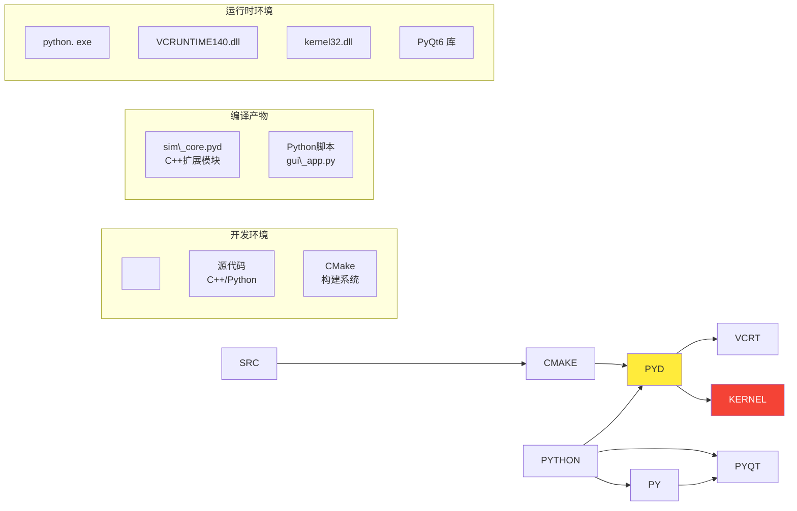

\# 类图与时序图


\*\*文档版本\*\*: v1.0  

\*\*创建日期\*\*: 2025-12-26  

\*\*作者\*\*: SAiNTe3


---


\## 目录


\- \[1. 概述](#1-概述)

\- \[2. 类图设计](#2-类图设计)

\- \[3. 时序图](#3-时序图)

\- \[4. 状态图](#4-状态图)

\- \[5. 活动图](#5-活动图)

\- \[6. 部署图](#6-部署图)


---


\## 1. 概述


\### 1.1 UML 图表说明


本文档包含以下 UML 图表：


| 图表类型 | 用途 | 工具 |

|---------|------|------|

| \*\*类图\*\* | 展示系统静态结构 | Mermaid |

| \*\*时序图\*\* | 展示对象间交互过程 | Mermaid |

| \*\*状态图\*\* | 展示哲学家状态转换 | Mermaid |

| \*\*活动图\*\* | 展示资源获取流程 | Mermaid |

| \*\*部署图\*\* | 展示系统部署结构 | Mermaid |


\### 1.2 符号说明


```

\[类名]

&nbsp; +:  public 成员

&nbsp; -: private 成员

&nbsp; #: protected 成员

&nbsp; 

&nbsp; \*--> :  组合关系

&nbsp; o--> : 聚合关系

&nbsp; --> : 关联关系

&nbsp; --|> : 继承关系

&nbsp; . .|> : 实现关系

```


---


\## 2. 类图设计


\### 2.1 核心类关系图


```mermaid

classDiagram

&nbsp;   %% ========== 核心类 ==========

&nbsp;   class Simulation {

&nbsp;       -int num\_philosophers

&nbsp;       -int num\_forks

&nbsp;       -volatile bool running

&nbsp;       -Strategy current\_strategy

&nbsp;       -vector~State~ states

&nbsp;       -vector~unique\_ptr~Fork~~ forks

&nbsp;       -vector~unique\_ptr~WinThread~~ threads

&nbsp;       -vector~int~ wait\_counts

&nbsp;       -vector~int~ eat\_counts

&nbsp;       -vector~int~ max\_wait\_counts

&nbsp;       -deque~SimEvent~ event\_queue

&nbsp;       -WinMutex event\_mutex

&nbsp;       -WinMutex state\_mutex

&nbsp;       -const int STARVATION\_THRESHOLD

&nbsp;       +Simulation(n\_phil, n\_forks)

&nbsp;       +~Simulation()

&nbsp;       +start() void

&nbsp;       +stop() void

&nbsp;       +set\_strategy(code) void

&nbsp;       +get\_states() vector~int~

&nbsp;       +get\_resource\_graph() vector~vector~int~~

&nbsp;       +poll\_events() vector~SimEvent~

&nbsp;       +detect\_deadlock() bool

&nbsp;       -philosopher\_thread(id) void

&nbsp;       -request\_permission(phil\_id, fork\_id) bool

&nbsp;       -is\_safe\_state(phil\_id, fork\_id) bool

&nbsp;       -log\_event(phil\_id, type, details) void

&nbsp;   }

&nbsp;   

&nbsp;   %% ========== 同步原语 ==========

&nbsp;   class WinMutex {

&nbsp;       -CRITICAL\_SECTION cs

&nbsp;       +WinMutex()

&nbsp;       +~WinMutex()

&nbsp;       +lock() void

&nbsp;       +try\_lock() bool

&nbsp;       +unlock() void

&nbsp;   }

&nbsp;   

&nbsp;   class WinLockGuard {

&nbsp;       -WinMutex\& mutex

&nbsp;       +WinLockGuard(m)

&nbsp;       +~WinLockGuard()

&nbsp;   }

&nbsp;   

&nbsp;   class WinSemaphore {

&nbsp;       -HANDLE handle

&nbsp;       +WinSemaphore(initial, max)

&nbsp;       +~WinSemaphore()

&nbsp;       +wait() void

&nbsp;       +try\_wait(timeout) bool

&nbsp;       +post() void

&nbsp;   }

&nbsp;   

&nbsp;   class WinThread {

&nbsp;       -HANDLE handle

&nbsp;       +WinThread()

&nbsp;       +~WinThread()

&nbsp;       +start(func) void

&nbsp;       +join() void

&nbsp;       +joinable() bool

&nbsp;       -thread\_proc(arg)$ unsigned int

&nbsp;   }

&nbsp;   

&nbsp;   %% ========== 资源类 ==========

&nbsp;   class Fork {

&nbsp;       +WinMutex mtx

&nbsp;       +int holder

&nbsp;       +Fork()

&nbsp;   }

&nbsp;   

&nbsp;   %% ========== 数据结构 ==========

&nbsp;   class SimEvent {

&nbsp;       +double timestamp

&nbsp;       +int phil\_id

&nbsp;       +string event\_type

&nbsp;       +string details

&nbsp;   }

&nbsp;   

&nbsp;   class State {

&nbsp;       <<enumeration>>

&nbsp;       THINKING

&nbsp;       HUNGRY

&nbsp;       EATING

&nbsp;   }

&nbsp;   

&nbsp;   class Strategy {

&nbsp;       <<enumeration>>

&nbsp;       NONE

&nbsp;       BANKER

&nbsp;   }

&nbsp;   

&nbsp;   %% ========== 关系 ==========

&nbsp;   Simulation "1" \*-- "N" WinThread :  管理

&nbsp;   Simulation "1" \*-- "M" Fork : 管理

&nbsp;   Simulation "1" \*-- "\*" SimEvent : 生产

&nbsp;   Simulation "1" \*-- "2" WinMutex : 使用

&nbsp;   Simulation --> State : 使用

&nbsp;   Simulation --> Strategy :  使用

&nbsp;   

&nbsp;   Fork "1" \*-- "1" WinMutex : 包含

&nbsp;   

&nbsp;   WinLockGuard --> WinMutex : 依赖

&nbsp;   

&nbsp;   %% ========== 注释 ==========

&nbsp;   note for Simulation "核心调度器\\n管理哲学家线程\\n协调资源分配"

&nbsp;   note for WinMutex "Windows临界区封装\\n基于CRITICAL\_SECTION"

&nbsp;   note for Fork "共享资源\\n互斥访问"

```


---


\### 2.2 详细类图（分模块）


\#### 2.2.1 同步原语模块


```mermaid

classDiagram

&nbsp;   %% 同步原语继承关系

&nbsp;   class ISyncPrimitive {

&nbsp;       <<interface>>

&nbsp;       +lock() void\*

&nbsp;       +unlock() void\*

&nbsp;   }

&nbsp;   

&nbsp;   class WinMutex {

&nbsp;       -CRITICAL\_SECTION cs

&nbsp;       +WinMutex()

&nbsp;       +~WinMutex()

&nbsp;       +lock() void

&nbsp;       +try\_lock() bool

&nbsp;       +unlock() void

&nbsp;   }

&nbsp;   

&nbsp;   class WinSemaphore {

&nbsp;       -HANDLE handle

&nbsp;       -long current\_count

&nbsp;       -long max\_count

&nbsp;       +WinSemaphore(initial, max)

&nbsp;       +~WinSemaphore()

&nbsp;       +wait() void

&nbsp;       +try\_wait(timeout) bool

&nbsp;       +post() void

&nbsp;       +get\_count() long

&nbsp;   }

&nbsp;   

&nbsp;   class WinLockGuard {

&nbsp;       -WinMutex\& mutex

&nbsp;       -bool locked

&nbsp;       +WinLockGuard(m)

&nbsp;       +~WinLockGuard()

&nbsp;   }

&nbsp;   

&nbsp;   class WinThread {

&nbsp;       -HANDLE handle

&nbsp;       -unsigned int thread\_id

&nbsp;       -function~void()~\* func

&nbsp;       +WinThread()

&nbsp;       +~WinThread()

&nbsp;       +start(func) void

&nbsp;       +join() void

&nbsp;       +detach() void

&nbsp;       +joinable() bool

&nbsp;       +get\_id() unsigned int

&nbsp;       -thread\_proc(arg)$ unsigned int

&nbsp;   }

&nbsp;   

&nbsp;   WinMutex . .|> ISyncPrimitive

&nbsp;   WinSemaphore . .|> ISyncPrimitive

&nbsp;   WinLockGuard --> WinMutex :  使用

```


\#### 2.2.2 资源管理模块


```mermaid

classDiagram

&nbsp;   class Fork {

&nbsp;       +WinMutex mtx

&nbsp;       +int holder

&nbsp;       +Fork()

&nbsp;       +try\_acquire(phil\_id) bool

&nbsp;       +release() void

&nbsp;       +is\_held\_by(phil\_id) bool

&nbsp;   }

&nbsp;   

&nbsp;   class ResourceManager {

&nbsp;       -vector~Fork\*~ forks

&nbsp;       -map~int,set~int~~ competitors

&nbsp;       +ResourceManager(n\_forks)

&nbsp;       +get\_fork(id) Fork\*

&nbsp;       +get\_competitors(phil\_id) set~int~

&nbsp;       +calculate\_competitors(n\_phil) void

&nbsp;   }

&nbsp;   

&nbsp;   class BankerAlgorithm {

&nbsp;       -vector~int~ available

&nbsp;       -vector~int~ need

&nbsp;       -vector~vector~int~~ allocation

&nbsp;       +is\_safe\_state(phil\_id, fork\_id) bool

&nbsp;       +request\_resource(phil\_id, fork\_id) bool

&nbsp;       -find\_safe\_sequence() bool

&nbsp;   }

&nbsp;   

&nbsp;   ResourceManager "1" o-- "N" Fork

&nbsp;   ResourceManager --> BankerAlgorithm :  使用

```


---


\## 3. 时序图


\### 3.1 哲学家就餐完整流程


```mermaid

sequenceDiagram

&nbsp;   autonumber

&nbsp;   participant P as Philosopher Thread

&nbsp;   participant SM as state\_mutex

&nbsp;   participant SIM as Simulation

&nbsp;   participant FL as Fork\[left]

&nbsp;   participant FR as Fork\[right]

&nbsp;   participant EQ as Event Queue

&nbsp;   

&nbsp;   %% ===== 思考阶段 =====

&nbsp;   rect rgb(200, 230, 255)

&nbsp;   note right of P:  阶段1: THINKING

&nbsp;   P->>+SM: lock()

&nbsp;   P->>P: states\[id] = THINKING

&nbsp;   P->>-SM: unlock()

&nbsp;   P->>EQ: log\_event("STATE", "THINKING")

&nbsp;   P->>P: Sleep(thinking\_time)

&nbsp;   end

&nbsp;   

&nbsp;   %% ===== 饥饿阶段 =====

&nbsp;   rect rgb(255, 230, 200)

&nbsp;   note right of P: 阶段2: HUNGRY

&nbsp;   P->>+SM: lock()

&nbsp;   P->>P: states\[id] = HUNGRY

&nbsp;   P->>P: wait\_counts\[id] = 0

&nbsp;   P->>-SM:  unlock()

&nbsp;   P->>EQ: log\_event("STATE", "HUNGRY")

&nbsp;   end

&nbsp;   

&nbsp;   %% ===== 获取左叉子 =====

&nbsp;   rect rgb(230, 255, 230)

&nbsp;   note right of P:  阶段3: 获取左叉子

&nbsp;   P->>+SIM: request\_permission(id, left)

&nbsp;   SIM->>+SM: lock()

&nbsp;   SIM->>SIM: 反饥饿检查

&nbsp;   SIM->>SIM:  Banker's Algorithm 检查

&nbsp;   SIM->>-SM: unlock()

&nbsp;   SIM-->>-P: return true

&nbsp;   

&nbsp;   P->>+FL: try\_lock()

&nbsp;   alt 成功获取

&nbsp;       FL-->>P: return true

&nbsp;       P->>FL: holder = id

&nbsp;       P->>EQ: log\_event("ACQUIRE", "Left Fork")

&nbsp;       P->>P: Sleep(10ms)

&nbsp;   else 失败

&nbsp;       FL-->>-P: return false

&nbsp;       P->>P: 重试

&nbsp;   end

&nbsp;   end

&nbsp;   

&nbsp;   %% ===== 获取右叉子 =====

&nbsp;   rect rgb(255, 255, 200)

&nbsp;   note right of P:  阶段4: 获取右叉子

&nbsp;   P->>+SIM: request\_permission(id, right)

&nbsp;   SIM->>SIM:  Banker's Algorithm 检查

&nbsp;   SIM-->>-P: return true

&nbsp;   

&nbsp;   P->>+FR:  try\_lock()

&nbsp;   alt 成功获取

&nbsp;       FR-->>P: return true

&nbsp;       P->>FR: holder = id

&nbsp;       P->>EQ: log\_event("ACQUIRE", "Right Fork")

&nbsp;   else 失败 - 回退

&nbsp;       FR-->>-P: return false

&nbsp;       P->>FL: holder = -1

&nbsp;       P->>FL: unlock()

&nbsp;       P->>EQ: log\_event("RELEASE", "Left Fork (Backoff)")

&nbsp;   end

&nbsp;   end

&nbsp;   

&nbsp;   %% ===== 进餐阶段 =====

&nbsp;   rect rgb(200, 255, 200)

&nbsp;   note right of P: 阶段5: EATING

&nbsp;   P->>+SM: lock()

&nbsp;   P->>P: states\[id] = EATING

&nbsp;   P->>P:  eat\_counts\[id]++

&nbsp;   P->>P: wait\_counts\[id] = 0

&nbsp;   P->>-SM: unlock()

&nbsp;   P->>EQ: log\_event("STATE", "EATING")

&nbsp;   P->>P: Sleep(eating\_time)

&nbsp;   end

&nbsp;   

&nbsp;   %% ===== 释放资源 =====

&nbsp;   rect rgb(255, 200, 200)

&nbsp;   note right of P: 阶段6: 释放叉子

&nbsp;   P->>FR: holder = -1

&nbsp;   P->>FR: unlock()

&nbsp;   P->>EQ: log\_event("RELEASE", "Right Fork")

&nbsp;   

&nbsp;   P->>FL: holder = -1

&nbsp;   P->>FL: unlock()

&nbsp;   P->>EQ: log\_event("RELEASE", "Left Fork")

&nbsp;   end

&nbsp;   

&nbsp;   note over P:  循环回到 THINKING

```


---


\### 3.2 死锁检测时序图


```mermaid

sequenceDiagram

&nbsp;   participant GUI as GUI Thread

&nbsp;   participant SIM as Simulation

&nbsp;   participant SM as state\_mutex

&nbsp;   participant RAG as Resource Graph

&nbsp;   

&nbsp;   GUI->>+SIM: detect\_deadlock()

&nbsp;   SIM->>+SM: lock()

&nbsp;   

&nbsp;   note over SIM:  构建等待图

&nbsp;   loop 遍历所有哲学家

&nbsp;       SIM->>SIM: if (state == HUNGRY)

&nbsp;       SIM->>RAG: 添加等待边 (P→F→P)

&nbsp;   end

&nbsp;   

&nbsp;   note over SIM: 环检测算法

&nbsp;   loop 遍历等待图

&nbsp;       SIM->>SIM: DFS 检测环路

&nbsp;       alt 发现环路

&nbsp;           SIM->>SIM: log\_event("DEADLOCK", "Cycle")

&nbsp;           SIM-->>GUI: return true

&nbsp;       end

&nbsp;   end

&nbsp;   

&nbsp;   SIM->>-SM: unlock()

&nbsp;   SIM-->>-GUI: return false

```


---


\### 3.3 事件队列生产消费时序图


```mermaid

sequenceDiagram

&nbsp;   participant P1 as Philosopher 1

&nbsp;   participant P2 as Philosopher 2

&nbsp;   participant PN as Philosopher N

&nbsp;   participant EM as event\_mutex

&nbsp;   participant EQ as event\_queue

&nbsp;   participant GUI as GUI Thread

&nbsp;   

&nbsp;   %% 生产者

&nbsp;   par 多生产者并发写入

&nbsp;       P1->>+EM: lock()

&nbsp;       P1->>EQ: push\_back(event1)

&nbsp;       P1->>-EM: unlock()

&nbsp;   and

&nbsp;       P2->>+EM:  lock()

&nbsp;       P2->>EQ: push\_back(event2)

&nbsp;       P2->>-EM: unlock()

&nbsp;   and

&nbsp;       PN->>+EM: lock()

&nbsp;       PN->>EQ: push\_back(eventN)

&nbsp;       PN->>-EM: unlock()

&nbsp;   end

&nbsp;   

&nbsp;   %% 消费者

&nbsp;   note over GUI: 每 50ms 轮询一次

&nbsp;   GUI->>+EM: lock()

&nbsp;   GUI->>EQ: 复制所有事件

&nbsp;   GUI->>EQ: clear()

&nbsp;   GUI->>-EM: unlock()

&nbsp;   GUI->>GUI: 更新 UI 显示

```


---


\## 4. 状态图


\### 4.1 哲学家状态转换图


```mermaid

stateDiagram-v2

&nbsp;   \[\*] --> THINKING :  线程启动

&nbsp;   

&nbsp;   THINKING --> HUNGRY : 完成思考\\nSleep(thinking\_time)

&nbsp;   

&nbsp;   HUNGRY --> HUNGRY : 等待叉子\\n尝试获取失败\\nwait\_count++

&nbsp;   

&nbsp;   HUNGRY --> EATING : 获得两把叉子\\nleft. try\_lock() \&\& right.try\_lock()

&nbsp;   

&nbsp;   EATING --> THINKING : 完成进餐\\nSleep(eating\_time)\\n释放叉子

&nbsp;   

&nbsp;   THINKING --> \[\*] : running = false\\n线程退出

&nbsp;   

&nbsp;   note right of THINKING

&nbsp;       状态码:  0

&nbsp;       颜色: 灰色

&nbsp;       持有资源: 无

&nbsp;   end note

&nbsp;   

&nbsp;   note right of HUNGRY

&nbsp;       状态码: 1

&nbsp;       颜色: 红色

&nbsp;       持有资源:  0-1 把叉子

&nbsp;       可能回退

&nbsp;   end note

&nbsp;   

&nbsp;   note right of EATING

&nbsp;       状态码: 2

&nbsp;       颜色: 绿色

&nbsp;       持有资源: 2 把叉子

&nbsp;   end note

```


---


\### 4.2 叉子状态转换图


```mermaid

stateDiagram-v2

&nbsp;   \[\*] --> FREE : 初始化\\nholder = -1

&nbsp;   

&nbsp;   FREE --> HELD : try\_lock() 成功\\nholder = phil\_id

&nbsp;   

&nbsp;   HELD --> FREE : unlock()\\nholder = -1

&nbsp;   

&nbsp;   FREE --> FREE : try\_lock() 失败\\n(被其他线程持有)

&nbsp;   

&nbsp;   note right of FREE

&nbsp;       可被任何哲学家获取

&nbsp;       mtx 未被锁定

&nbsp;   end note

&nbsp;   

&nbsp;   note right of HELD

&nbsp;       被特定哲学家持有

&nbsp;       mtx 已锁定

&nbsp;       holder 记录持有者 ID

&nbsp;   end note

```


---


\## 5. 活动图


\### 5.1 资源获取活动图


```mermaid

flowchart TD

&nbsp;   Start(\[哲学家进入 HUNGRY]) --> CheckLeft{检查左叉子\\n是否可用?}

&nbsp;   

&nbsp;   CheckLeft -->|不可用| IncWait\[wait\_count++]

&nbsp;   IncWait --> Wait\[Sleep 50ms]

&nbsp;   Wait --> CheckLeft

&nbsp;   

&nbsp;   CheckLeft -->|可用| AntiStarve{反饥饿检查\\n有更饥饿者?}

&nbsp;   AntiStarve -->|是| IncWait

&nbsp;   

&nbsp;   AntiStarve -->|否| BankerLeft{Banker算法\\n分配左叉安全?}

&nbsp;   BankerLeft -->|不安全| IncWait

&nbsp;   

&nbsp;   BankerLeft -->|安全| TryLeft\[try\_lock 左叉]

&nbsp;   TryLeft --> LeftOK{成功? }

&nbsp;   LeftOK -->|否| IncWait

&nbsp;   

&nbsp;   LeftOK -->|是| SetLeft\[holder = id]

&nbsp;   SetLeft --> LogLeft\[记录事件:  ACQUIRE Left]

&nbsp;   LogLeft --> Delay\[Sleep 10ms]

&nbsp;   

&nbsp;   Delay --> CheckRight{检查右叉子\\n是否可用?}

&nbsp;   CheckRight -->|不可用| ReleaseLeft

&nbsp;   

&nbsp;   CheckRight -->|可用| BankerRight{Banker算法\\n分配右叉安全?}

&nbsp;   BankerRight -->|不安全| ReleaseLeft

&nbsp;   

&nbsp;   BankerRight -->|安全| TryRight\[try\_lock 右叉]

&nbsp;   TryRight --> RightOK{成功?}

&nbsp;   RightOK -->|否| ReleaseLeft

&nbsp;   

&nbsp;   ReleaseLeft\[释放左叉\\nholder=-1\\nunlock] --> LogBackoff\[记录事件:  Backoff]

&nbsp;   LogBackoff --> IncWait

&nbsp;   

&nbsp;   RightOK -->|是| SetRight\[holder = id]

&nbsp;   SetRight --> LogRight\[记录事件: ACQUIRE Right]

&nbsp;   LogRight --> Eating\[进入 EATING 状态]

&nbsp;   

&nbsp;   Eating --> EatTime\[Sleep eating\_time]

&nbsp;   EatTime --> ReleaseRight\[释放右叉]

&nbsp;   ReleaseRight --> ReleaseFinal\[释放左叉]

&nbsp;   ReleaseFinal --> End(\[返回 THINKING])

&nbsp;   

&nbsp;   style Start fill:#e1f5ff

&nbsp;   style End fill:#c8e6c9

&nbsp;   style Eating fill:#a5d6a7

&nbsp;   style IncWait fill:#ffccbc

&nbsp;   style ReleaseLeft fill:#ffccbc

```


---


\### 5.2 Banker's Algorithm 活动图


```mermaid

flowchart TD

&nbsp;   Start(\[is\_safe\_state]) --> Init\[初始化:\\navailable\[]\\nneed\[]]

&nbsp;   

&nbsp;   Init --> MarkAlloc\[标记已分配资源]

&nbsp;   MarkAlloc --> Simulate\[模拟分配请求的资源]

&nbsp;   

&nbsp;   Simulate --> CheckAvail{请求的资源\\n当前可用?}

&nbsp;   CheckAvail -->|否| ReturnFalse\[return false]

&nbsp;   

&nbsp;   CheckAvail -->|是| MarkReq\[available\[fork\_id] = 0\\nneed\[phil\_id]--]

&nbsp;   

&nbsp;   MarkReq --> InitFinish\[finish\[] = false\\nfinished\_count = 0]

&nbsp;   

&nbsp;   InitFinish --> WhileLoop{finished\_count\\n< num\_phil?}

&nbsp;   WhileLoop -->|否| ReturnTrue\[return true]

&nbsp;   

&nbsp;   WhileLoop -->|是| FindNext\[寻找可完成的哲学家]

&nbsp;   

&nbsp;   FindNext --> ForEach\[遍历所有哲学家]

&nbsp;   ForEach --> CheckFinish{已完成? }

&nbsp;   CheckFinish -->|是| NextPhil\[下一个]

&nbsp;   

&nbsp;   CheckFinish -->|否| CheckNeed{need\[i] <= 0?}

&nbsp;   CheckNeed -->|是| MarkFinish

&nbsp;   

&nbsp;   CheckNeed -->|否| CheckForks{能获得\\n所需叉子?}

&nbsp;   CheckForks -->|否| NextPhil

&nbsp;   

&nbsp;   CheckForks -->|是| MarkFinish\[finish\[i] = true\\nfinished\_count++\\nfound = true]

&nbsp;   MarkFinish --> ReleaseForks\[释放该哲学家\\n占用的资源]

&nbsp;   ReleaseForks --> NextPhil

&nbsp;   

&nbsp;   NextPhil --> MorePhil{还有未检查\\n的哲学家?}

&nbsp;   MorePhil -->|是| CheckFinish

&nbsp;   MorePhil -->|否| FoundAny{found == true?}

&nbsp;   

&nbsp;   FoundAny -->|是| WhileLoop

&nbsp;   FoundAny -->|否| ReturnFalse

&nbsp;   

&nbsp;   ReturnTrue --> EndTrue(\[安全状态])

&nbsp;   ReturnFalse --> EndFalse(\[不安全状态])

&nbsp;   

&nbsp;   style EndTrue fill:#c8e6c9

&nbsp;   style EndFalse fill:#ffcdd2

```


---


\## 6. 部署图


\### 6.1 物理部署结构


```mermaid

graph TB

&nbsp;   subgraph "用户态 (User Space)"

&nbsp;       subgraph "Python 进程"

&nbsp;           GUI\[PyQt6 GUI<br/>主线程]

&nbsp;           TEST\[测试框架<br/>主线程]

&nbsp;       end

&nbsp;       

&nbsp;       subgraph "C++ 扩展模块 (sim\_core. pyd)"

&nbsp;           BIND\[pybind11<br/>绑定层]

&nbsp;           SIM\[Simulation 对象]

&nbsp;           

&nbsp;           subgraph "哲学家线程池"

&nbsp;               T1\[Thread 1]

&nbsp;               T2\[Thread 2]

&nbsp;               TN\[Thread N]

&nbsp;           end

&nbsp;       end

&nbsp;   end

&nbsp;   

&nbsp;   subgraph "内核态 (Kernel Space)"

&nbsp;       subgraph "Windows Kernel"

&nbsp;           KTHREAD\[线程调度器]

&nbsp;           KSYNC\[同步管理器]

&nbsp;           KMEM\[内存管理器]

&nbsp;       end

&nbsp;   end

&nbsp;   

&nbsp;   GUI -->|C API 调用| BIND

&nbsp;   TEST -->|C API 调用| BIND

&nbsp;   BIND -->|C++ 调用| SIM

&nbsp;   SIM -->|创建/管理| T1

&nbsp;   SIM -->|创建/管理| T2

&nbsp;   SIM -->|创建/管理| TN

&nbsp;   

&nbsp;   T1 -.系统调用. -> KTHREAD

&nbsp;   T2 -.系统调用.-> KTHREAD

&nbsp;   TN -.系统调用. -> KTHREAD

&nbsp;   

&nbsp;   SIM -.EnterCriticalSection.-> KSYNC

&nbsp;   T1 -.WaitForSingleObject.-> KSYNC

&nbsp;   

&nbsp;   style GUI fill:#e1f5ff

&nbsp;   style TEST fill:#e1f5ff

&nbsp;   style BIND fill:#fff9c4

&nbsp;   style SIM fill:#c8e6c9

&nbsp;   style KTHREAD fill:#ffccbc

&nbsp;   style KSYNC fill:#ffccbc

```


---


\### 6.2 组件部署图





---


\## 7. 交互序列详解


\### 7.1 GUI 更新循环


```mermaid

sequenceDiagram

&nbsp;   participant QT as QTimer

&nbsp;   participant W as DiningWidget

&nbsp;   participant S as Simulation (C++)

&nbsp;   participant P as Philosopher Threads

&nbsp;   

&nbsp;   note over QT: 每 50ms 触发一次

&nbsp;   

&nbsp;   loop 定时器循环

&nbsp;       QT->>W: timeout 信号

&nbsp;       W->>+S: get\_states()

&nbsp;       S-->>-W: \[0, 1, 2, 0, 1]

&nbsp;       

&nbsp;       W->>+S: get\_resource\_graph()

&nbsp;       S-->>-W: \[\[phil, fork, holding], ...]

&nbsp;       

&nbsp;       W->>+S: poll\_events()

&nbsp;       S-->>-W: \[event1, event2, ...]

&nbsp;       

&nbsp;       W->>W: update() 触发重绘

&nbsp;       

&nbsp;       note over W: paintEvent() 执行

&nbsp;       W->>W: 绘制哲学家状态

&nbsp;       W->>W: 绘制资源分配图

&nbsp;   end

&nbsp;   

&nbsp;   par 并发执行

&nbsp;       P->>P: 哲学家线程持续运行

&nbsp;   end

```


---


\### 7.2 测试框架交互


```mermaid

sequenceDiagram

&nbsp;   participant TEST as 测试脚本

&nbsp;   participant SIM as Simulation

&nbsp;   participant MON as psutil Monitor

&nbsp;   participant REPORT as Report Generator

&nbsp;   

&nbsp;   TEST->>+SIM:  Simulation(15, 14)

&nbsp;   SIM-->>-TEST: 创建对象

&nbsp;   

&nbsp;   TEST->>MON: 启动资源监控

&nbsp;   

&nbsp;   TEST->>+SIM: start()

&nbsp;   SIM->>SIM: 创建 15 个线程

&nbsp;   SIM-->>-TEST: 返回

&nbsp;   

&nbsp;   loop 运行 300 秒

&nbsp;       MON->>MON: 记录 CPU/内存

&nbsp;       note over TEST: Sleep 1秒

&nbsp;   end

&nbsp;   

&nbsp;   TEST->>+SIM: poll\_events()

&nbsp;   SIM-->>-TEST: 返回所有事件

&nbsp;   

&nbsp;   TEST->>+SIM: stop()

&nbsp;   SIM->>SIM: 等待所有线程

&nbsp;   SIM-->>-TEST:  返回

&nbsp;   

&nbsp;   TEST->>MON: 停止监控

&nbsp;   MON-->>TEST: 统计数据

&nbsp;   

&nbsp;   TEST->>+REPORT: generate\_report(data)

&nbsp;   REPORT->>REPORT: 生成 Markdown

&nbsp;   REPORT-->>-TEST:  保存文件

```


---


\## 8. 设计模式应用


\### 8.1 模式汇总


| 模式 | 应用场景 | 实现位置 |

|------|---------|---------|

| \*\*生产者-消费者\*\* | 事件队列 | `event\_queue` |

| \*\*RAII\*\* | 锁管理 | `WinLockGuard` |

| \*\*工厂方法\*\* | 线程创建 | `WinThread:: start()` |

| \*\*单例\*\* | (未使用) | - |

| \*\*策略模式\*\* | 资源分配策略 | `Strategy` 枚举 |

| \*\*观察者\*\* | GUI 更新 | QTimer + 轮询 |


\### 8.2 生产者-消费者模式


```mermaid

classDiagram

&nbsp;   class Producer {

&nbsp;       <<interface>>

&nbsp;       +produce() void

&nbsp;   }

&nbsp;   

&nbsp;   class Consumer {

&nbsp;       <<interface>>

&nbsp;       +consume() void

&nbsp;   }

&nbsp;   

&nbsp;   class PhilosopherThread {

&nbsp;       +run() void

&nbsp;   }

&nbsp;   

&nbsp;   class GUIThread {

&nbsp;       +update() void

&nbsp;   }

&nbsp;   

&nbsp;   class EventQueue {

&nbsp;       -deque~SimEvent~ queue

&nbsp;       -WinMutex mutex

&nbsp;       +push(event) void

&nbsp;       +pop\_all() vector

&nbsp;   }

&nbsp;   

&nbsp;   Producer <|.. PhilosopherThread

&nbsp;   Consumer <|.. GUIThread

&nbsp;   

&nbsp;   PhilosopherThread --> EventQueue :  生产

&nbsp;   GUIThread --> EventQueue :  消费

```


---


\## 9. 总结


\### 9.1 UML 图表覆盖


| 图表类型 | 数量 | 说明 |

|---------|------|------|

| 类图 | 3 | 核心类、同步原语、资源管理 |

| 时序图 | 3 | 就餐流程、死锁检测、事件队列 |

| 状态图 | 2 | 哲学家状态、叉子状态 |

| 活动图 | 2 | 资源获取、Banker算法 |

| 部署图 | 2 | 物理部署、组件部署 |


\### 9.2 设计亮点


\- ✅ \*\*清晰的层次结构\*\*:  从用户态到内核态

\- ✅ \*\*完整的交互流程\*\*: 覆盖所有关键场景

\- ✅ \*\*详细的状态转换\*\*: 哲学家和资源的状态机

\- ✅ \*\*复杂算法可视化\*\*:  Banker算法流程图


\### 9.3 图表使用建议


\- \*\*开发阶段\*\*: 参考类图理解代码结构

\- \*\*调试阶段\*\*: 参考时序图追踪执行流程

\- \*\*答辩阶段\*\*: 展示活动图解释算法逻辑

\- \*\*文档编写\*\*: 引用状态图说明系统行为


---


\*\*文档版本历史\*\*:  

\- v1.0 (2025-12-26): 初始版本

